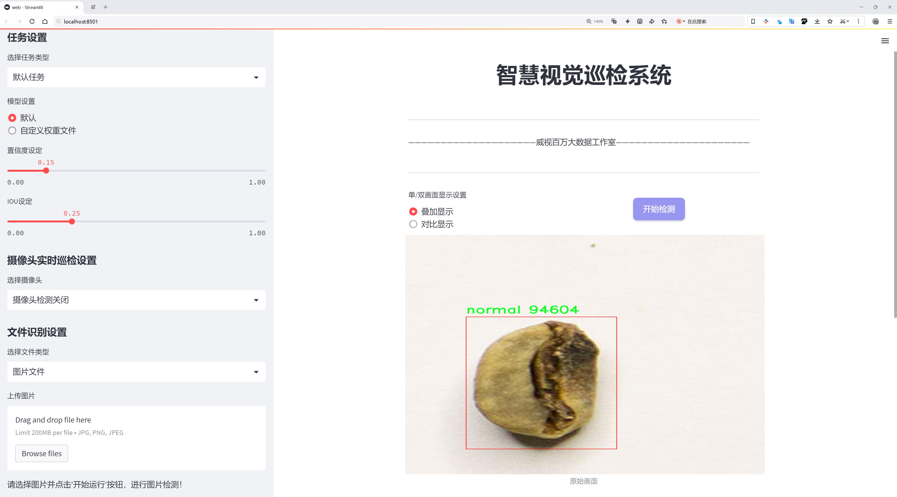
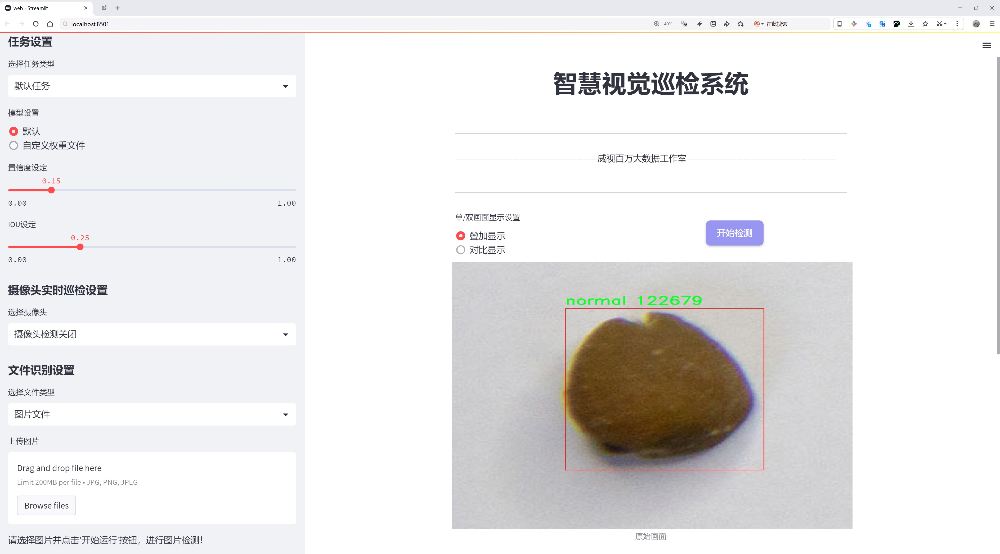
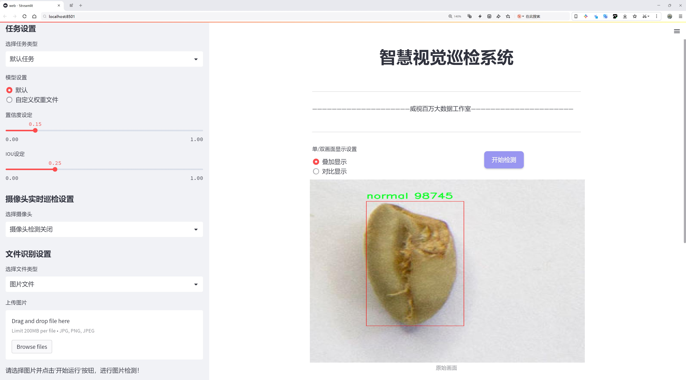
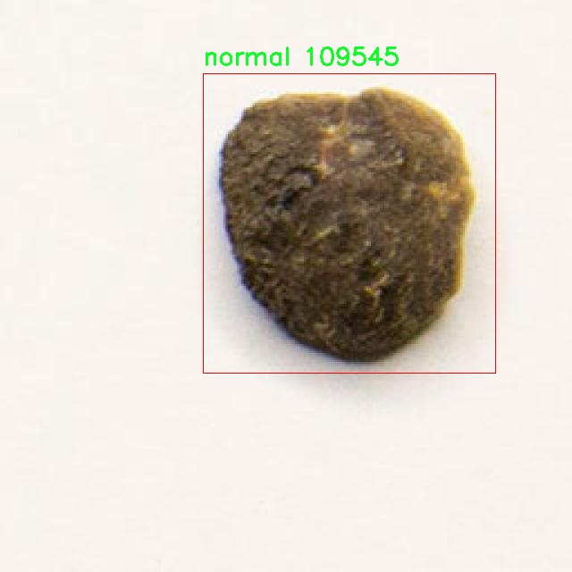
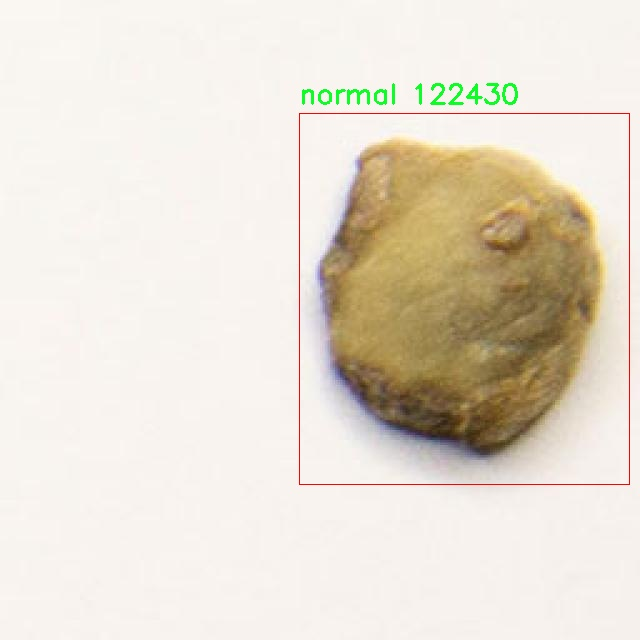
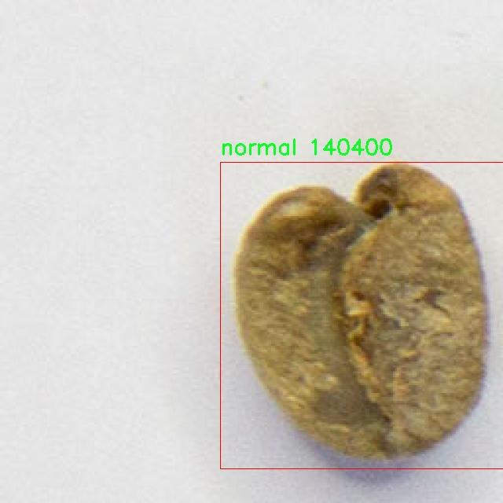
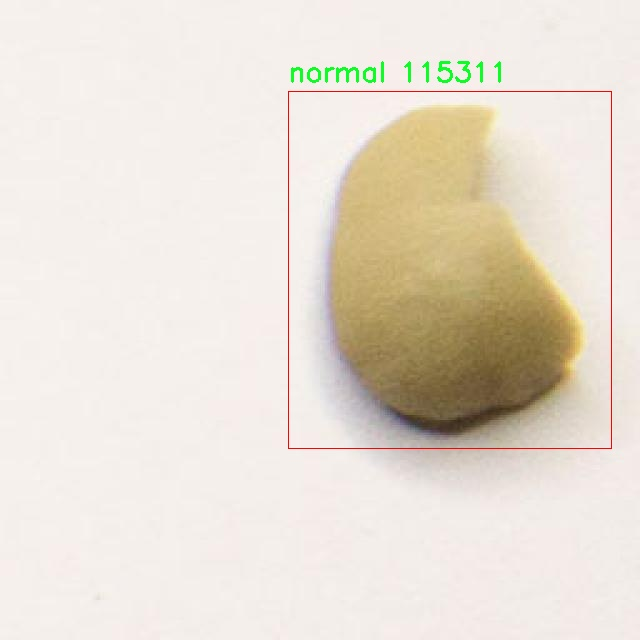
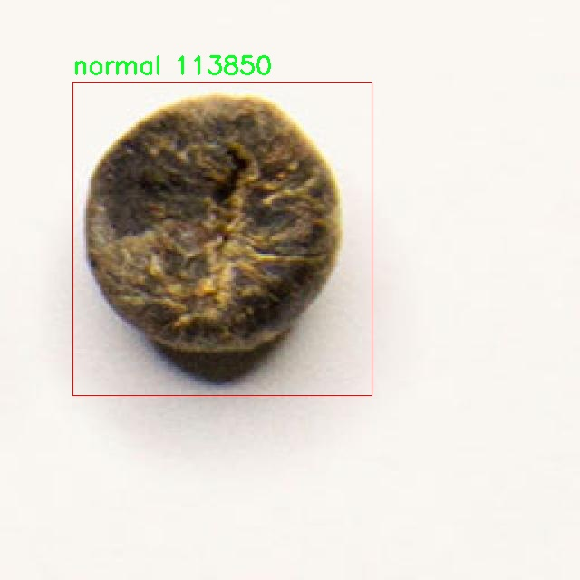

# 绿咖啡豆缺陷检测检测系统源码分享
 # [一条龙教学YOLOV8标注好的数据集一键训练_70+全套改进创新点发刊_Web前端展示]

### 1.研究背景与意义

项目参考[AAAI Association for the Advancement of Artificial Intelligence](https://gitee.com/qunshansj/projects)

项目来源[AACV Association for the Advancement of Computer Vision](https://gitee.com/qunmasj/projects)

研究背景与意义

随着全球咖啡消费的持续增长，咖啡产业的质量控制显得尤为重要。绿咖啡豆作为咖啡生产的初始原料，其质量直接影响到最终咖啡的风味和市场价值。然而，传统的人工检测方法不仅耗时耗力，而且容易受到人为因素的影响，导致检测结果的不一致性。因此，开发一种高效、准确的绿咖啡豆缺陷检测系统显得尤为迫切。

近年来，深度学习技术的迅猛发展为图像识别和物体检测领域带来了革命性的变化。YOLO（You Only Look Once）系列模型以其高效的实时检测能力和优越的准确性，逐渐成为物体检测任务中的主流选择。YOLOv8作为该系列的最新版本，进一步提升了模型的性能和适用性，尤其在处理复杂背景和多类别物体时表现出色。然而，针对特定领域的应用，如绿咖啡豆缺陷检测，现有的YOLOv8模型仍需进行改进和优化，以适应特定的检测需求。

本研究旨在基于改进的YOLOv8模型，构建一个专门针对绿咖啡豆缺陷检测的系统。通过对2800张图像的深度学习训练，模型将能够识别和分类绿咖啡豆的缺陷，具体包括两类缺陷（类别0和类别1）。这种针对性的训练不仅能够提高检测的准确性，还能有效减少误检和漏检的情况，从而为咖啡生产企业提供可靠的质量控制工具。

在数据集方面，所使用的2800张图像为模型的训练和验证提供了丰富的样本基础。数据集的多样性和代表性将直接影响模型的泛化能力和实用性。通过对图像数据的精细标注和分类，研究将能够确保模型在实际应用中的有效性。此外，改进YOLOv8模型的过程将涉及到数据增强、模型结构优化和超参数调优等多个方面，以确保其在绿咖啡豆缺陷检测任务中的最佳表现。

本研究的意义不仅在于技术上的创新，更在于其对咖啡产业的实际应用价值。通过引入先进的深度学习技术，能够显著提高绿咖啡豆的质量检测效率，降低人工成本，提升产品的市场竞争力。同时，系统的成功应用将为其他农产品的质量检测提供借鉴，推动农业智能化的发展。综上所述，基于改进YOLOv8的绿咖啡豆缺陷检测系统的研究，具有重要的理论价值和广泛的实际应用前景。

### 2.图片演示







##### 注意：由于此博客编辑较早，上面“2.图片演示”和“3.视频演示”展示的系统图片或者视频可能为老版本，新版本在老版本的基础上升级如下：（实际效果以升级的新版本为准）

  （1）适配了YOLOV8的“目标检测”模型和“实例分割”模型，通过加载相应的权重（.pt）文件即可自适应加载模型。

  （2）支持“图片识别”、“视频识别”、“摄像头实时识别”三种识别模式。

  （3）支持“图片识别”、“视频识别”、“摄像头实时识别”三种识别结果保存导出，解决手动导出（容易卡顿出现爆内存）存在的问题，识别完自动保存结果并导出到tempDir中。

  （4）支持Web前端系统中的标题、背景图等自定义修改，后面提供修改教程。

  另外本项目提供训练的数据集和训练教程,暂不提供权重文件（best.pt）,需要您按照教程进行训练后实现图片演示和Web前端界面演示的效果。

### 3.视频演示

[3.1 视频演示](https://www.bilibili.com/video/BV1aTtee5Enp/)

### 4.数据集信息展示

##### 4.1 本项目数据集详细数据（类别数＆类别名）

nc: 2
names: ['defect', 'normal']


##### 4.2 本项目数据集信息介绍

数据集信息展示

在本研究中，我们使用了名为“greencoffee”的数据集，以训练和改进YOLOv8模型，旨在实现高效的绿咖啡豆缺陷检测系统。该数据集专门针对绿咖啡豆的质量评估而设计，包含了两种主要类别：缺陷（defect）和正常（normal）。通过对这两类样本的深入分析和处理，我们希望能够提高模型在实际应用中的准确性和鲁棒性。

“greencoffee”数据集的构建考虑到了绿咖啡豆在生产和贸易过程中可能遇到的各种缺陷。这些缺陷可能包括但不限于虫害、霉变、发酵等问题，这些问题不仅影响咖啡豆的外观，还会对其风味和品质产生深远的影响。因此，准确检测这些缺陷对于咖啡产业的质量控制至关重要。数据集中包含的“缺陷”类别样本，均为经过精心挑选和标注的真实案例，确保了数据的真实性和多样性。而“正常”类别则代表了未受损的绿咖啡豆，作为对比样本，帮助模型学习如何区分健康与有缺陷的豆子。

数据集的规模和多样性也是其一大亮点。为了确保模型的泛化能力，数据集涵盖了不同种类、不同生长环境以及不同处理方式的绿咖啡豆。这种多样性使得模型在面对不同来源的咖啡豆时，能够更好地适应并进行准确的缺陷检测。此外，数据集中的图像质量经过严格把控，确保每张图像都具有清晰的细节和良好的分辨率，这对于后续的特征提取和模型训练至关重要。

在数据预处理阶段，我们对“greencoffee”数据集进行了多种增强处理，以提升模型的训练效果。这些处理包括图像旋转、缩放、翻转以及亮度和对比度的调整等，旨在模拟不同的拍摄条件和环境变化，从而提高模型的鲁棒性。通过这些技术手段，我们希望能够使模型在实际应用中，面对不同的光照、角度和背景时，依然能够保持高效的检测能力。

在模型训练过程中，我们将“greencoffee”数据集分为训练集和验证集，以便于评估模型的性能。训练集用于模型的学习和参数调整，而验证集则用于实时监测模型的准确性和泛化能力。通过不断迭代和优化，我们期望最终得到一个能够在实际生产环境中有效运行的绿咖啡豆缺陷检测系统。

综上所述，“greencoffee”数据集不仅为我们提供了丰富的样本和多样的特征，还为模型的训练和评估奠定了坚实的基础。通过对该数据集的深入研究和应用，我们相信能够显著提升YOLOv8在绿咖啡豆缺陷检测中的表现，为咖啡产业的质量控制提供强有力的技术支持。











### 5.全套项目环境部署视频教程（零基础手把手教学）

[5.1 环境部署教程链接（零基础手把手教学）](https://www.ixigua.com/7404473917358506534?logTag=c807d0cbc21c0ef59de5)


[5.2 安装Python虚拟环境创建和依赖库安装视频教程链接（零基础手把手教学）](https://www.ixigua.com/7404474678003106304?logTag=1f1041108cd1f708b01a)

### 6.手把手YOLOV8训练视频教程（零基础小白有手就能学会）

[6.1 手把手YOLOV8训练视频教程（零基础小白有手就能学会）](https://www.ixigua.com/7404477157818401292?logTag=d31a2dfd1983c9668658)

### 7.70+种全套YOLOV8创新点代码加载调参视频教程（一键加载写好的改进模型的配置文件）

[7.1 70+种全套YOLOV8创新点代码加载调参视频教程（一键加载写好的改进模型的配置文件）](https://www.ixigua.com/7404478314661806627?logTag=29066f8288e3f4eea3a4)

### 8.70+种全套YOLOV8创新点原理讲解（非科班也可以轻松写刊发刊，V10版本正在科研待更新）

由于篇幅限制，每个创新点的具体原理讲解就不一一展开，具体见下列网址中的创新点对应子项目的技术原理博客网址【Blog】：


[8.1 70+种全套YOLOV8创新点原理讲解链接](https://gitee.com/qunmasj/good)

### 9.系统功能展示（检测对象为举例，实际内容以本项目数据集为准）

图9.1.系统支持检测结果表格显示

  图9.2.系统支持置信度和IOU阈值手动调节

  图9.3.系统支持自定义加载权重文件best.pt(需要你通过步骤5中训练获得)

  图9.4.系统支持摄像头实时识别

  图9.5.系统支持图片识别

  图9.6.系统支持视频识别

  图9.7.系统支持识别结果文件自动保存

  图9.8.系统支持Excel导出检测结果数据


### 10.原始YOLOV8算法原理

原始YOLOv8算法原理

YOLOv8作为目标检测领域的最新进展，代表了对YOLO系列算法的又一次重要革新。该算法在设计上充分考虑了实时性与准确性的平衡，致力于在各种复杂场景中实现高效的目标检测。YOLOv8的结构主要由输入层、主干网络、颈部网络和头部网络组成，这些组件的协同工作使得YOLOv8能够在多种应用场景中表现出色。

在YOLOv8的工作流程中，首先是输入层对图像进行处理。输入图像会被缩放到指定的尺寸，以确保后续处理的一致性。这一过程不仅是为了适应网络的输入要求，同时也为后续的特征提取奠定了基础。YOLOv8在特征提取方面采用了主干网络，这一部分通过一系列卷积操作对输入图像进行下采样，从而提取出丰富的特征信息。值得注意的是，每个卷积层都结合了批归一化和SiLU激活函数，这样的设计旨在提高模型的收敛速度和稳定性。

主干网络的设计是YOLOv8的一大亮点。它引入了C2f块，这一模块的设计灵感来源于YOLOv7中的E-ELAN结构。C2f块通过跨层分支连接来增强模型的梯度流动，从而有效改善检测结果。这种结构的引入使得YOLOv8在特征提取的过程中，能够更好地捕捉到不同层次的特征信息，进而提升了模型的整体性能。此外，主干网络末尾的SPPFl块通过三个最大池化层的组合，进一步增强了网络的特征抽象能力，使得模型在面对多尺度特征时能够更加从容应对。

在特征融合方面，YOLOv8采用了颈部网络，这一部分利用了FPNS（特征金字塔网络）和PAN（路径聚合网络）结构，旨在融合来自不同尺度的特征图信息。通过这种方式，YOLOv8能够有效整合来自主干网络的多层特征，从而为后续的目标检测提供更加全面的信息支持。颈部网络的设计使得YOLOv8在处理复杂场景时，能够兼顾细节与全局信息，进而提升检测的准确性。

YOLOv8的头部网络则采用了解耦的检测头结构，这一创新设计将分类和回归任务分开处理，分别通过两个并行的卷积分支进行计算。这种解耦的设计使得模型在处理目标检测时，能够更加灵活地应对不同类型的任务，进而提升了检测的效率和准确性。同时，YOLOv8还采用了无锚点的检测策略，进一步简化了目标检测的过程，使得模型在面对多样化的目标时，能够更加自如地进行检测。

在训练过程中，YOLOv8引入了一系列数据增强策略，以提高模型的泛化能力。特别是在最后的训练阶段，YOLOv8关闭了马赛克增强，并采用了动态的样本分配策略，这一策略旨在根据任务的需求动态调整样本的分配，从而提升模型的训练效率。此外，YOLOv8在损失计算方面也进行了优化，采用了BCELoss作为分类损失，DFLLoss与CIoULoss作为回归损失，这一组合使得模型在训练过程中能够更好地平衡分类与回归的需求。

总的来说，YOLOv8在设计上充分考虑了实时性与准确性的平衡，通过一系列创新的结构与策略，使得模型在目标检测任务中表现出色。无论是在特征提取、特征融合，还是在检测头的设计上，YOLOv8都展现出了其独特的优势。随着YOLOv8的推出，目标检测技术又向前迈进了一大步，为各类应用场景提供了更加高效、准确的解决方案。通过对YOLOv8的深入研究与应用，未来的目标检测技术将更加成熟，为各行各业的智能化发展提供强有力的支持。


### 11.项目核心源码讲解（再也不用担心看不懂代码逻辑）

#### 11.1 ui.py

以下是代码的核心部分，并附上详细的中文注释：

```python
import sys
import subprocess

def run_script(script_path):
    """
    使用当前 Python 环境运行指定的脚本。

    Args:
        script_path (str): 要运行的脚本路径

    Returns:
        None
    """
    # 获取当前 Python 解释器的路径
    python_path = sys.executable

    # 构建运行命令，使用 streamlit 运行指定的脚本
    command = f'"{python_path}" -m streamlit run "{script_path}"'

    # 执行命令
    result = subprocess.run(command, shell=True)
    
    # 检查命令执行结果，如果返回码不为0，表示出错
    if result.returncode != 0:
        print("脚本运行出错。")

# 实例化并运行应用
if __name__ == "__main__":
    # 指定要运行的脚本路径
    script_path = "web.py"  # 假设脚本在当前目录下

    # 调用函数运行脚本
    run_script(script_path)
```

### 代码分析与注释：

1. **导入模块**：
   - `import sys`: 导入系统相关的模块，用于获取当前 Python 解释器的路径。
   - `import subprocess`: 导入子进程模块，用于在 Python 中执行外部命令。

2. **定义 `run_script` 函数**：
   - 该函数接受一个参数 `script_path`，表示要运行的 Python 脚本的路径。
   - 函数内部首先获取当前 Python 解释器的路径，以便后续调用。

3. **构建命令**：
   - 使用 `streamlit` 运行指定的脚本，构建的命令格式为：`python -m streamlit run "脚本路径"`。

4. **执行命令**：
   - 使用 `subprocess.run` 执行构建的命令，`shell=True` 表示在 shell 中执行该命令。
   - 通过 `result.returncode` 检查命令的执行结果，如果返回码不为0，表示执行过程中出现错误，打印错误信息。

5. **主程序入口**：
   - 使用 `if __name__ == "__main__":` 确保该部分代码仅在直接运行该脚本时执行。
   - 指定要运行的脚本路径（这里假设为 `web.py`）。
   - 调用 `run_script` 函数来执行指定的脚本。

### 总结：
该代码的核心功能是通过当前 Python 环境运行指定的 Streamlit 脚本，并在执行出错时给出提示。

这个文件名为 `ui.py`，其主要功能是通过当前的 Python 环境来运行一个指定的脚本。代码首先导入了必要的模块，包括 `sys`、`os` 和 `subprocess`，这些模块提供了与系统交互的功能。

在文件中定义了一个名为 `run_script` 的函数，该函数接受一个参数 `script_path`，表示要运行的脚本的路径。函数内部首先获取当前 Python 解释器的路径，这通过 `sys.executable` 实现。接着，构建了一个命令字符串，该命令使用当前的 Python 解释器来运行 `streamlit`，并指定要运行的脚本路径。

随后，使用 `subprocess.run` 方法执行构建好的命令。这个方法会在一个新的进程中运行命令，并等待其完成。如果命令执行后返回的状态码不为零，表示脚本运行出错，程序会输出相应的错误信息。

在文件的最后部分，使用 `if __name__ == "__main__":` 语句来确保当该文件作为主程序运行时，才会执行以下代码。这里指定了要运行的脚本路径为 `web.py`，并调用 `run_script` 函数来执行这个脚本。

总的来说，这个程序的作用是提供一个简单的接口，通过命令行运行一个名为 `web.py` 的脚本，适用于需要在特定环境下执行 Python 脚本的场景。

#### 11.2 70+种YOLOv8算法改进源码大全和调试加载训练教程（非必要）\ultralytics\nn\modules\transformer.py

以下是代码中最核心的部分，并附上详细的中文注释：

```python
import torch
import torch.nn as nn
import torch.nn.functional as F

class TransformerEncoderLayer(nn.Module):
    """定义一个Transformer编码器层。"""

    def __init__(self, c1, cm=2048, num_heads=8, dropout=0.0, act=nn.GELU(), normalize_before=False):
        """初始化TransformerEncoderLayer，设置参数。
        
        参数:
        c1: 输入特征的维度。
        cm: 前馈网络中间层的维度。
        num_heads: 多头注意力的头数。
        dropout: dropout的比率。
        act: 激活函数，默认为GELU。
        normalize_before: 是否在每个子层之前进行归一化。
        """
        super().__init__()
        self.ma = nn.MultiheadAttention(c1, num_heads, dropout=dropout, batch_first=True)  # 多头注意力层
        self.fc1 = nn.Linear(c1, cm)  # 前馈网络的第一层
        self.fc2 = nn.Linear(cm, c1)  # 前馈网络的第二层
        self.norm1 = nn.LayerNorm(c1)  # 第一层归一化
        self.norm2 = nn.LayerNorm(c1)  # 第二层归一化
        self.dropout = nn.Dropout(dropout)  # dropout层
        self.dropout1 = nn.Dropout(dropout)  # 第一层dropout
        self.dropout2 = nn.Dropout(dropout)  # 第二层dropout
        self.act = act  # 激活函数
        self.normalize_before = normalize_before  # 是否在前面归一化

    def forward(self, src, src_mask=None, src_key_padding_mask=None, pos=None):
        """通过编码器模块进行前向传播。
        
        参数:
        src: 输入特征。
        src_mask: 自注意力的掩码。
        src_key_padding_mask: 输入的填充掩码。
        pos: 位置编码。
        
        返回:
        经过编码器层处理后的特征。
        """
        if self.normalize_before:
            return self.forward_pre(src, src_mask, src_key_padding_mask, pos)
        return self.forward_post(src, src_mask, src_key_padding_mask, pos)

    def forward_post(self, src, src_mask=None, src_key_padding_mask=None, pos=None):
        """后归一化的前向传播。"""
        q = k = self.with_pos_embed(src, pos)  # 添加位置编码
        src2 = self.ma(q, k, value=src, attn_mask=src_mask, key_padding_mask=src_key_padding_mask)[0]  # 计算注意力
        src = src + self.dropout1(src2)  # 残差连接
        src = self.norm1(src)  # 归一化
        src2 = self.fc2(self.dropout(self.act(self.fc1(src))))  # 前馈网络
        src = src + self.dropout2(src2)  # 残差连接
        return self.norm2(src)  # 归一化

    def forward_pre(self, src, src_mask=None, src_key_padding_mask=None, pos=None):
        """前归一化的前向传播。"""
        src2 = self.norm1(src)  # 归一化
        q = k = self.with_pos_embed(src2, pos)  # 添加位置编码
        src2 = self.ma(q, k, value=src2, attn_mask=src_mask, key_padding_mask=src_key_padding_mask)[0]  # 计算注意力
        src = src + self.dropout1(src2)  # 残差连接
        src2 = self.norm2(src)  # 归一化
        src2 = self.fc2(self.dropout(self.act(self.fc1(src2))))  # 前馈网络
        return src + self.dropout2(src2)  # 残差连接

    @staticmethod
    def with_pos_embed(tensor, pos=None):
        """如果提供了位置编码，则将其添加到张量中。"""
        return tensor if pos is None else tensor + pos

class AIFI(TransformerEncoderLayer):
    """定义AIFI Transformer层。"""

    def forward(self, x):
        """AIFI Transformer层的前向传播。"""
        c, h, w = x.shape[1:]  # 获取输入的通道数、高度和宽度
        pos_embed = self.build_2d_sincos_position_embedding(w, h, c)  # 构建2D位置编码
        x = super().forward(x.flatten(2).permute(0, 2, 1), pos=pos_embed.to(device=x.device, dtype=x.dtype))  # 通过父类的前向传播
        return x.permute(0, 2, 1).view([-1, c, h, w]).contiguous()  # 恢复原始形状

    @staticmethod
    def build_2d_sincos_position_embedding(w, h, embed_dim=256, temperature=10000.0):
        """构建2D正弦余弦位置编码。"""
        grid_w = torch.arange(int(w), dtype=torch.float32)  # 水平网格
        grid_h = torch.arange(int(h), dtype=torch.float32)  # 垂直网格
        grid_w, grid_h = torch.meshgrid(grid_w, grid_h, indexing='ij')  # 创建网格
        pos_dim = embed_dim // 4  # 位置维度
        omega = torch.arange(pos_dim, dtype=torch.float32) / pos_dim  # 计算频率
        omega = 1. / (temperature ** omega)  # 归一化频率

        out_w = grid_w.flatten()[..., None] @ omega[None]  # 水平位置编码
        out_h = grid_h.flatten()[..., None] @ omega[None]  # 垂直位置编码

        return torch.cat([torch.sin(out_w), torch.cos(out_w), torch.sin(out_h), torch.cos(out_h)], 1)[None]  # 返回位置编码

class MLPBlock(nn.Module):
    """实现多层感知机的单个块。"""

    def __init__(self, embedding_dim, mlp_dim, act=nn.GELU):
        """初始化MLPBlock，设置嵌入维度、MLP维度和激活函数。"""
        super().__init__()
        self.lin1 = nn.Linear(embedding_dim, mlp_dim)  # 第一层线性变换
        self.lin2 = nn.Linear(mlp_dim, embedding_dim)  # 第二层线性变换
        self.act = act()  # 激活函数

    def forward(self, x: torch.Tensor) -> torch.Tensor:
        """MLPBlock的前向传播。"""
        return self.lin2(self.act(self.lin1(x)))  # 通过两层线性变换和激活函数

class DeformableTransformerDecoderLayer(nn.Module):
    """可变形Transformer解码器层。"""

    def __init__(self, d_model=256, n_heads=8, d_ffn=1024, dropout=0., act=nn.ReLU(), n_levels=4, n_points=4):
        """初始化DeformableTransformerDecoderLayer，设置参数。"""
        super().__init__()
        self.self_attn = nn.MultiheadAttention(d_model, n_heads, dropout=dropout)  # 自注意力层
        self.cross_attn = MSDeformAttn(d_model, n_levels, n_heads, n_points)  # 交叉注意力层
        self.linear1 = nn.Linear(d_model, d_ffn)  # 前馈网络的第一层
        self.linear2 = nn.Linear(d_ffn, d_model)  # 前馈网络的第二层
        self.act = act  # 激活函数

    def forward(self, embed, refer_bbox, feats, shapes, padding_mask=None, attn_mask=None, query_pos=None):
        """通过整个解码器层进行前向传播。"""
        q = k = self.with_pos_embed(embed, query_pos)  # 添加位置编码
        tgt = self.self_attn(q.transpose(0, 1), k.transpose(0, 1), embed.transpose(0, 1), attn_mask=attn_mask)[0].transpose(0, 1)  # 自注意力
        embed = embed + tgt  # 残差连接
        tgt = self.cross_attn(self.with_pos_embed(embed, query_pos), refer_bbox.unsqueeze(2), feats, shapes, padding_mask)  # 交叉注意力
        embed = embed + tgt  # 残差连接
        tgt2 = self.linear2(self.act(self.linear1(embed)))  # 前馈网络
        return embed + tgt2  # 残差连接

    @staticmethod
    def with_pos_embed(tensor, pos):
        """如果提供了位置编码，则将其添加到张量中。"""
        return tensor if pos is None else tensor + pos
```

### 代码说明：
1. **TransformerEncoderLayer**: 这是一个Transformer编码器层的实现，包含多头自注意力机制和前馈网络。它支持前后归一化两种模式。
2. **AIFI**: 这是一个特定的Transformer层，扩展自`TransformerEncoderLayer`，用于处理带有2D位置编码的输入。
3. **MLPBlock**: 实现了一个简单的多层感知机（MLP），用于特征的非线性变换。
4. **DeformableTransformerDecoderLayer**: 实现了可变形Transformer解码器层，包含自注意力和交叉注意力机制。

这些核心部分是实现Transformer架构的基础，能够处理各种输入特征并进行有效的特征学习。

这个程序文件是YOLOv8算法中的一个重要模块，主要实现了与Transformer相关的功能。文件中定义了多个类，主要包括TransformerEncoderLayer、AIFI、TransformerLayer、TransformerBlock、MLPBlock、MLP、LayerNorm2d、MSDeformAttn、DeformableTransformerDecoderLayer和DeformableTransformerDecoder。这些类共同构成了一个复杂的神经网络结构，主要用于处理图像特征并进行目标检测。

首先，TransformerEncoderLayer类定义了一个Transformer编码器层。它的构造函数接收多个参数，包括输入通道数、隐藏层维度、头数、dropout比率、激活函数等。该类实现了前向传播方法，支持后归一化和前归一化两种模式，使用多头自注意力机制和前馈神经网络来处理输入数据。

AIFI类是TransformerEncoderLayer的一个扩展，增加了对二维位置嵌入的支持。它在前向传播中构建了二维正弦余弦位置嵌入，并将输入张量进行变形，以适应Transformer的输入格式。

TransformerLayer类实现了一个基本的Transformer层，包含自注意力机制和前馈网络。它的前向传播方法通过线性变换和多头注意力来处理输入数据，并返回经过处理的输出。

TransformerBlock类则是将多个TransformerLayer组合在一起，形成一个完整的Transformer模块。它可以选择性地使用卷积层来调整输入和输出的通道数，并在前向传播中应用位置嵌入。

MLPBlock和MLP类实现了多层感知机（MLP）的功能，MLPBlock用于构建单个MLP块，而MLP类则实现了一个简单的多层感知机，支持多层结构的前向传播。

LayerNorm2d类实现了二维层归一化，用于对输入数据进行归一化处理，以提高模型的稳定性和收敛速度。

MSDeformAttn类实现了多尺度可变形注意力机制，支持在不同尺度上对输入特征进行加权处理。它的前向传播方法根据查询、参考边界框和特征值进行计算，输出经过处理的特征。

DeformableTransformerDecoderLayer和DeformableTransformerDecoder类实现了可变形Transformer解码器层和解码器的功能。解码器层通过自注意力和交叉注意力机制来处理输入特征，并通过前馈网络生成最终输出。解码器则将多个解码器层组合在一起，完成目标检测任务中的边界框回归和分类。

整体来看，这个文件实现了YOLOv8中与Transformer相关的多个模块，利用自注意力机制和前馈网络对图像特征进行处理，旨在提高目标检测的性能和准确性。

#### 11.3 code\ultralytics\utils\callbacks\tensorboard.py

以下是经过简化并添加详细中文注释的核心代码部分：

```python
# 导入必要的库
from ultralytics.utils import LOGGER, SETTINGS, TESTS_RUNNING, colorstr

try:
    # 尝试导入TensorBoard的SummaryWriter
    from torch.utils.tensorboard import SummaryWriter

    # 确保当前不是在测试环境中
    assert not TESTS_RUNNING  
    # 确保TensorBoard集成已启用
    assert SETTINGS["tensorboard"] is True  
    WRITER = None  # 初始化TensorBoard的SummaryWriter实例

except (ImportError, AssertionError, TypeError, AttributeError):
    # 处理导入错误或断言错误
    SummaryWriter = None  # 如果导入失败，则将SummaryWriter设置为None


def _log_scalars(scalars, step=0):
    """将标量值记录到TensorBoard中。"""
    if WRITER:  # 如果WRITER存在
        for k, v in scalars.items():  # 遍历标量字典
            WRITER.add_scalar(k, v, step)  # 记录标量值


def _log_tensorboard_graph(trainer):
    """将模型图记录到TensorBoard中。"""
    try:
        import warnings
        from ultralytics.utils.torch_utils import de_parallel, torch

        imgsz = trainer.args.imgsz  # 获取输入图像大小
        imgsz = (imgsz, imgsz) if isinstance(imgsz, int) else imgsz  # 确保图像大小为元组
        p = next(trainer.model.parameters())  # 获取模型参数以确定设备和类型
        im = torch.zeros((1, 3, *imgsz), device=p.device, dtype=p.dtype)  # 创建输入图像（必须为零而不是空）

        with warnings.catch_warnings():
            warnings.simplefilter("ignore", category=UserWarning)  # 忽略JIT跟踪警告
            WRITER.add_graph(torch.jit.trace(de_parallel(trainer.model), im, strict=False), [])  # 记录模型图
    except Exception as e:
        LOGGER.warning(f"WARNING ⚠️ TensorBoard图形可视化失败 {e}")  # 记录警告信息


def on_pretrain_routine_start(trainer):
    """初始化TensorBoard记录，使用SummaryWriter。"""
    if SummaryWriter:  # 如果SummaryWriter可用
        try:
            global WRITER
            WRITER = SummaryWriter(str(trainer.save_dir))  # 创建SummaryWriter实例
            prefix = colorstr("TensorBoard: ")
            LOGGER.info(f"{prefix}使用 'tensorboard --logdir {trainer.save_dir}' 启动，查看地址 http://localhost:6006/")
        except Exception as e:
            LOGGER.warning(f"WARNING ⚠️ TensorBoard未正确初始化，未记录此运行。 {e}")  # 记录警告信息


def on_train_epoch_end(trainer):
    """在训练周期结束时记录标量统计信息。"""
    _log_scalars(trainer.label_loss_items(trainer.tloss, prefix="train"), trainer.epoch + 1)  # 记录训练损失
    _log_scalars(trainer.lr, trainer.epoch + 1)  # 记录学习率


# 定义回调函数字典，根据SummaryWriter是否可用来决定是否注册回调
callbacks = (
    {
        "on_pretrain_routine_start": on_pretrain_routine_start,
        "on_train_start": on_train_start,
        "on_fit_epoch_end": on_fit_epoch_end,
        "on_train_epoch_end": on_train_epoch_end,
    }
    if SummaryWriter
    else {}
)
```

### 代码核心部分说明：
1. **导入和初始化**：导入所需的库，并尝试初始化TensorBoard的`SummaryWriter`。如果失败，则设置为`None`。
2. **记录标量**：`_log_scalars`函数用于将标量值（如损失和学习率）记录到TensorBoard。
3. **记录模型图**：`_log_tensorboard_graph`函数用于将模型的计算图记录到TensorBoard，方便可视化模型结构。
4. **训练过程中的回调**：定义了多个回调函数，用于在训练过程的不同阶段记录信息，例如在预训练开始时初始化TensorBoard，在每个训练周期结束时记录损失和学习率等。
5. **回调字典**：根据`SummaryWriter`的可用性，决定是否注册回调函数。

这个程序文件是一个用于集成TensorBoard的回调模块，主要用于在训练过程中记录和可视化模型的训练状态和性能指标。文件中首先导入了一些必要的模块和工具，包括日志记录器、设置参数以及TensorBoard的SummaryWriter类。通过try-except结构，程序确保在不支持TensorBoard的环境中不会抛出错误，而是将SummaryWriter设置为None。

在程序中定义了几个主要的函数。`_log_scalars`函数用于将标量值记录到TensorBoard中，接收一个字典形式的标量数据和当前步数作为参数。`_log_tensorboard_graph`函数则用于将模型的计算图记录到TensorBoard中，确保输入的图像是一个全零的张量，并使用torch.jit.trace进行模型的追踪。

接下来的几个函数分别在不同的训练阶段被调用。`on_pretrain_routine_start`函数在训练开始前初始化TensorBoard的记录器，并输出相关信息以指导用户如何查看TensorBoard。`on_train_start`函数在训练开始时调用，记录模型的计算图。`on_train_epoch_end`和`on_fit_epoch_end`函数则分别在每个训练周期结束时记录训练损失和学习率，以及其他训练指标。

最后，程序通过一个字典`callbacks`将这些回调函数进行组织，只有在成功导入SummaryWriter的情况下，才会将这些回调函数注册到字典中，以便在训练过程中被调用。这种设计确保了代码的灵活性和可扩展性，能够适应不同的训练环境和需求。

#### 11.4 train.py

以下是经过简化和注释的核心代码部分：

```python
import random
import numpy as np
import torch.nn as nn
from ultralytics.data import build_dataloader, build_yolo_dataset
from ultralytics.engine.trainer import BaseTrainer
from ultralytics.models import yolo
from ultralytics.nn.tasks import DetectionModel
from ultralytics.utils import LOGGER, RANK
from ultralytics.utils.torch_utils import de_parallel, torch_distributed_zero_first

class DetectionTrainer(BaseTrainer):
    """
    基于检测模型的训练类，继承自BaseTrainer类。
    """

    def build_dataset(self, img_path, mode="train", batch=None):
        """
        构建YOLO数据集。

        参数:
            img_path (str): 包含图像的文件夹路径。
            mode (str): 模式，可以是'train'或'val'，用户可以为每种模式自定义不同的增强。
            batch (int, optional): 批次大小，适用于'rect'模式。默认为None。
        """
        gs = max(int(de_parallel(self.model).stride.max() if self.model else 0), 32)
        return build_yolo_dataset(self.args, img_path, batch, self.data, mode=mode, rect=mode == "val", stride=gs)

    def get_dataloader(self, dataset_path, batch_size=16, rank=0, mode="train"):
        """构造并返回数据加载器。"""
        assert mode in ["train", "val"]
        with torch_distributed_zero_first(rank):  # 在分布式环境中只初始化一次数据集
            dataset = self.build_dataset(dataset_path, mode, batch_size)
        shuffle = mode == "train"  # 训练模式下打乱数据
        workers = self.args.workers if mode == "train" else self.args.workers * 2
        return build_dataloader(dataset, batch_size, workers, shuffle, rank)  # 返回数据加载器

    def preprocess_batch(self, batch):
        """对一批图像进行预处理，包括缩放和转换为浮点数。"""
        batch["img"] = batch["img"].to(self.device, non_blocking=True).float() / 255  # 将图像归一化到[0, 1]
        if self.args.multi_scale:  # 如果启用多尺度训练
            imgs = batch["img"]
            sz = (
                random.randrange(self.args.imgsz * 0.5, self.args.imgsz * 1.5 + self.stride)
                // self.stride
                * self.stride
            )  # 随机选择新的尺寸
            sf = sz / max(imgs.shape[2:])  # 计算缩放因子
            if sf != 1:
                ns = [
                    math.ceil(x * sf / self.stride) * self.stride for x in imgs.shape[2:]
                ]  # 计算新的形状
                imgs = nn.functional.interpolate(imgs, size=ns, mode="bilinear", align_corners=False)  # 进行插值
            batch["img"] = imgs
        return batch

    def get_model(self, cfg=None, weights=None, verbose=True):
        """返回YOLO检测模型。"""
        model = DetectionModel(cfg, nc=self.data["nc"], verbose=verbose and RANK == -1)
        if weights:
            model.load(weights)  # 加载权重
        return model

    def plot_training_samples(self, batch, ni):
        """绘制带有注释的训练样本。"""
        plot_images(
            images=batch["img"],
            batch_idx=batch["batch_idx"],
            cls=batch["cls"].squeeze(-1),
            bboxes=batch["bboxes"],
            paths=batch["im_file"],
            fname=self.save_dir / f"train_batch{ni}.jpg",
            on_plot=self.on_plot,
        )

    def plot_metrics(self):
        """从CSV文件中绘制指标。"""
        plot_results(file=self.csv, on_plot=self.on_plot)  # 保存结果图
```

### 代码注释说明：
1. **类定义**：`DetectionTrainer`类继承自`BaseTrainer`，用于YOLO模型的训练。
2. **构建数据集**：`build_dataset`方法根据给定的图像路径和模式构建YOLO数据集，支持训练和验证模式。
3. **获取数据加载器**：`get_dataloader`方法构造数据加载器，支持分布式训练，并根据模式决定是否打乱数据。
4. **预处理批次**：`preprocess_batch`方法对输入的图像批次进行归一化和多尺度处理。
5. **获取模型**：`get_model`方法返回YOLO检测模型，并可选择加载预训练权重。
6. **绘制训练样本**：`plot_training_samples`方法用于可视化训练样本及其注释。
7. **绘制指标**：`plot_metrics`方法用于从CSV文件中绘制训练过程中的指标。

这个程序文件 `train.py` 是一个用于训练 YOLO（You Only Look Once）目标检测模型的脚本，继承自 `BaseTrainer` 类。该脚本主要包含数据集构建、数据加载、模型设置、训练过程中的损失计算、进度显示、结果可视化等功能。

首先，程序导入了必要的库和模块，包括数学运算、随机数生成、深度学习相关的 PyTorch 库，以及 YOLO 模型和数据处理的工具。接着定义了 `DetectionTrainer` 类，该类用于训练基于 YOLO 的检测模型。

在 `build_dataset` 方法中，程序根据传入的图像路径和模式（训练或验证）构建 YOLO 数据集。该方法使用了 `build_yolo_dataset` 函数，并根据模型的步幅（stride）进行处理，以确保数据集的构建符合模型的要求。

`get_dataloader` 方法用于构建数据加载器，确保在分布式训练时只初始化一次数据集，并根据训练或验证模式设置数据加载的参数。此方法还会根据模式决定是否打乱数据。

`preprocess_batch` 方法负责对输入的图像批次进行预处理，包括将图像缩放到合适的大小并转换为浮点数格式。此处还考虑了多尺度训练的情况，通过随机选择图像的大小来增强模型的鲁棒性。

`set_model_attributes` 方法用于设置模型的属性，包括类别数量和类别名称，以便模型能够正确处理不同的目标类别。

`get_model` 方法返回一个 YOLO 检测模型的实例，并在需要时加载预训练的权重。

`get_validator` 方法返回一个用于验证模型性能的验证器，能够计算损失并保存验证结果。

`label_loss_items` 方法用于返回一个包含训练损失项的字典，方便后续的损失监控和分析。

`progress_string` 方法返回一个格式化的字符串，显示训练进度，包括当前的 epoch、GPU 内存使用情况、损失值、实例数量和图像大小等信息。

`plot_training_samples` 方法用于绘制训练样本及其标注，便于可视化训练数据的质量。

最后，`plot_metrics` 和 `plot_training_labels` 方法分别用于绘制训练过程中的指标和创建带标签的训练图，以便分析模型的训练效果和数据集的标注情况。

整体来看，这个脚本为 YOLO 模型的训练提供了全面的支持，包括数据处理、模型设置、训练监控和结果可视化等功能，适合用于目标检测任务的开发和研究。

#### 11.5 code\ultralytics\utils\callbacks\__init__.py

以下是代码中最核心的部分，并附上详细的中文注释：

```python
# 导入基础模块中的函数
from .base import add_integration_callbacks, default_callbacks, get_default_callbacks

# 定义模块的公开接口，指定可以被外部访问的函数
__all__ = "add_integration_callbacks", "default_callbacks", "get_default_callbacks"
```

### 代码注释说明：

1. `from .base import add_integration_callbacks, default_callbacks, get_default_callbacks`：
   - 这一行代码从当前包的 `base` 模块中导入了三个函数：`add_integration_callbacks`、`default_callbacks` 和 `get_default_callbacks`。这些函数可能用于处理回调或集成相关的功能。

2. `__all__ = "add_integration_callbacks", "default_callbacks", "get_default_callbacks"`：
   - 这一行定义了模块的 `__all__` 变量，它是一个字符串元组，指定了当前模块中可以被外部导入的公共接口。只有在 `from module import *` 语句中，列在 `__all__` 中的名称才会被导入。这有助于控制模块的可见性和防止命名冲突。

这个程序文件是一个Python模块，属于Ultralytics YOLO项目的一部分，主要用于回调函数的管理。文件的第一行是一个注释，表明该项目使用的是AGPL-3.0许可证，并且是Ultralytics YOLO的相关代码。

接下来的几行代码从当前包的`base`模块中导入了三个函数：`add_integration_callbacks`、`default_callbacks`和`get_default_callbacks`。这些函数的具体功能可能与回调机制有关，回调通常用于在特定事件发生时执行某些操作，比如在训练过程中监控性能或保存模型。

最后，`__all__`变量被定义为一个元组，包含了三个导入的函数名。这意味着当使用`from module import *`语句导入该模块时，只会导入这三个函数，其他未列出的内容将不会被导入。这是一种控制模块导出内容的方式，确保只暴露必要的接口给外部使用。

总的来说，这个文件的主要作用是作为一个接口，整合和提供与回调相关的功能，方便其他模块或程序使用。

#### 11.6 70+种YOLOv8算法改进源码大全和调试加载训练教程（非必要）\ultralytics\data\build.py

以下是代码中最核心的部分，并附上详细的中文注释：

```python
import os
import random
import numpy as np
import torch
from torch.utils.data import dataloader, distributed
from .dataset import YOLODataset
from .utils import PIN_MEMORY

class InfiniteDataLoader(dataloader.DataLoader):
    """
    无限数据加载器，重用工作线程。

    该类使用与普通 DataLoader 相同的语法。
    """

    def __init__(self, *args, **kwargs):
        """初始化无限数据加载器，继承自 DataLoader。"""
        super().__init__(*args, **kwargs)
        # 设置批次采样器为重复采样器
        object.__setattr__(self, 'batch_sampler', _RepeatSampler(self.batch_sampler))
        self.iterator = super().__iter__()

    def __len__(self):
        """返回批次采样器的长度。"""
        return len(self.batch_sampler.sampler)

    def __iter__(self):
        """创建一个无限重复的采样器。"""
        for _ in range(len(self)):
            yield next(self.iterator)

    def reset(self):
        """
        重置迭代器。

        当我们想在训练过程中修改数据集设置时，这个方法很有用。
        """
        self.iterator = self._get_iterator()


class _RepeatSampler:
    """
    永久重复的采样器。

    参数:
        sampler (Dataset.sampler): 要重复的采样器。
    """

    def __init__(self, sampler):
        """初始化一个永久重复给定采样器的对象。"""
        self.sampler = sampler

    def __iter__(self):
        """迭代 'sampler' 并返回其内容。"""
        while True:
            yield from iter(self.sampler)


def seed_worker(worker_id):
    """设置数据加载器工作线程的随机种子。"""
    worker_seed = torch.initial_seed() % 2 ** 32  # 获取当前线程的随机种子
    np.random.seed(worker_seed)  # 设置 numpy 随机种子
    random.seed(worker_seed)  # 设置 random 随机种子


def build_yolo_dataset(cfg, img_path, batch, data, mode='train', rect=False, stride=32):
    """构建 YOLO 数据集。"""
    return YOLODataset(
        img_path=img_path,  # 图像路径
        imgsz=cfg.imgsz,  # 图像大小
        batch_size=batch,  # 批次大小
        augment=mode == 'train',  # 是否进行数据增强
        hyp=cfg,  # 超参数配置
        rect=cfg.rect or rect,  # 是否使用矩形批次
        cache=cfg.cache or None,  # 是否缓存数据
        single_cls=cfg.single_cls or False,  # 是否单类检测
        stride=int(stride),  # 步幅
        pad=0.0 if mode == 'train' else 0.5,  # 填充
        prefix=colorstr(f'{mode}: '),  # 模式前缀
        use_segments=cfg.task == 'segment',  # 是否使用分割
        use_keypoints=cfg.task == 'pose',  # 是否使用关键点
        classes=cfg.classes,  # 类别
        data=data,  # 数据配置
        fraction=cfg.fraction if mode == 'train' else 1.0  # 训练时的样本比例
    )


def build_dataloader(dataset, batch, workers, shuffle=True, rank=-1):
    """返回用于训练或验证集的 InfiniteDataLoader 或 DataLoader。"""
    batch = min(batch, len(dataset))  # 确保批次大小不超过数据集大小
    nd = torch.cuda.device_count()  # 获取 CUDA 设备数量
    nw = min([os.cpu_count() // max(nd, 1), batch if batch > 1 else 0, workers])  # 计算工作线程数量
    sampler = None if rank == -1 else distributed.DistributedSampler(dataset, shuffle=shuffle)  # 分布式采样器
    generator = torch.Generator()  # 创建随机数生成器
    generator.manual_seed(6148914691236517205 + RANK)  # 设置随机种子
    return InfiniteDataLoader(dataset=dataset,
                              batch_size=batch,
                              shuffle=shuffle and sampler is None,
                              num_workers=nw,
                              sampler=sampler,
                              pin_memory=PIN_MEMORY,
                              collate_fn=getattr(dataset, 'collate_fn', None),
                              worker_init_fn=seed_worker,
                              generator=generator)  # 返回无限数据加载器


def check_source(source):
    """检查源类型并返回相应的标志值。"""
    webcam, screenshot, from_img, in_memory, tensor = False, False, False, False, False
    if isinstance(source, (str, int, Path)):  # 字符串、整数或路径类型
        source = str(source)
        is_file = Path(source).suffix[1:] in (IMG_FORMATS + VID_FORMATS)  # 检查是否为文件
        is_url = source.lower().startswith(('https://', 'http://', 'rtsp://', 'rtmp://', 'tcp://'))  # 检查是否为 URL
        webcam = source.isnumeric() or source.endswith('.streams') or (is_url and not is_file)  # 检查是否为摄像头
        screenshot = source.lower() == 'screen'  # 检查是否为屏幕截图
        if is_url and is_file:
            source = check_file(source)  # 下载文件
    elif isinstance(source, LOADERS):
        in_memory = True  # 如果是加载器，标记为内存中
    elif isinstance(source, (list, tuple)):
        source = autocast_list(source)  # 将列表元素转换为 PIL 或 np 数组
        from_img = True
    elif isinstance(source, (Image.Image, np.ndarray)):
        from_img = True  # 如果是图像或数组
    elif isinstance(source, torch.Tensor):
        tensor = True  # 如果是张量
    else:
        raise TypeError('不支持的图像类型。支持的类型请参见文档。')

    return source, webcam, screenshot, from_img, in_memory, tensor


def load_inference_source(source=None, imgsz=640, vid_stride=1, buffer=False):
    """
    加载用于目标检测的推理源并应用必要的转换。

    参数:
        source (str, Path, Tensor, PIL.Image, np.ndarray): 输入源。
        imgsz (int, optional): 推理图像大小，默认为 640。
        vid_stride (int, optional): 视频源的帧间隔，默认为 1。
        buffer (bool, optional): 是否缓冲流帧，默认为 False。

    返回:
        dataset (Dataset): 指定输入源的数据集对象。
    """
    source, webcam, screenshot, from_img, in_memory, tensor = check_source(source)  # 检查源类型
    # 根据源类型加载数据集
    if tensor:
        dataset = LoadTensor(source)  # 加载张量
    elif in_memory:
        dataset = source  # 使用内存中的数据
    elif webcam:
        dataset = LoadStreams(source, imgsz=imgsz, vid_stride=vid_stride, buffer=buffer)  # 加载摄像头流
    elif screenshot:
        dataset = LoadScreenshots(source, imgsz=imgsz)  # 加载屏幕截图
    elif from_img:
        dataset = LoadPilAndNumpy(source, imgsz=imgsz)  # 加载 PIL 或 numpy 图像
    else:
        dataset = LoadImages(source, imgsz=imgsz, vid_stride=vid_stride)  # 加载图像

    # 将源类型附加到数据集
    setattr(dataset, 'source_type', source_type)

    return dataset  # 返回数据集对象
```

以上代码主要实现了一个用于 YOLO（You Only Look Once）目标检测模型的数据加载和处理框架，包括无限数据加载器、数据集构建、源检查和推理源加载等功能。每个函数和类都有详细的中文注释，便于理解其功能和用法。

这个程序文件是一个用于构建YOLO（You Only Look Once）模型数据加载器的模块，主要用于处理数据集的加载和预处理。文件中定义了一些类和函数，以便在训练和推理过程中高效地管理数据。

首先，文件导入了一些必要的库，包括操作系统、随机数生成、路径处理、NumPy、PyTorch等。它还引入了YOLO相关的数据加载器和工具函数，确保可以处理多种数据源和格式。

接下来，定义了一个名为`InfiniteDataLoader`的类，它继承自PyTorch的`DataLoader`。这个类的特点是可以无限循环使用工作线程，从而在训练过程中不断提供数据。`__iter__`方法实现了一个无限迭代器，可以不断从数据集中获取下一个批次的数据。此外，`reset`方法允许在训练过程中重置迭代器，以便在需要时修改数据集的设置。

`_RepeatSampler`类则是一个辅助类，用于实现无限重复的采样器。它的`__iter__`方法会不断迭代给定的采样器，确保数据的持续供应。

`seed_worker`函数用于设置数据加载器工作线程的随机种子，以确保在多线程环境下的随机性一致性。

`build_yolo_dataset`函数负责构建YOLO数据集，接收配置参数、图像路径、批次大小等信息，并返回一个`YOLODataset`对象。这个函数会根据当前模式（训练或验证）来决定是否进行数据增强，并设置其他相关参数。

`build_dataloader`函数则用于创建一个`InfiniteDataLoader`或标准的`DataLoader`，根据给定的数据集、批次大小和工作线程数量进行配置。它还考虑了分布式训练的情况，能够根据CUDA设备的数量和可用的CPU核心数来优化工作线程的数量。

`check_source`函数用于检查输入数据源的类型，并返回相应的标志值。这包括检查输入是否为文件、URL、摄像头、图像数组等，并确保输入的格式是支持的。

最后，`load_inference_source`函数用于加载推理源，处理输入数据并应用必要的转换。根据输入源的类型，它会选择不同的加载方式，如从张量、内存、摄像头、截图或图像文件中加载数据，并返回一个数据集对象。

整体来看，这个文件的主要功能是提供一个灵活且高效的数据加载和处理框架，以支持YOLO模型的训练和推理过程。通过使用无限数据加载器和多种数据源支持，它能够提高模型训练的效率和便利性。

### 12.系统整体结构（节选）

### 整体功能和构架概括

该项目是一个基于YOLOv8目标检测算法的实现，包含多个模块和工具，用于模型的训练、推理、数据处理和可视化。项目的整体架构可以分为以下几个主要部分：

1. **用户界面（UI）**：提供了一个简单的界面，用于运行和管理模型训练及推理。
2. **模型模块**：实现了YOLOv8及其改进版本的模型结构，包括Transformer模块和其他相关组件。
3. **数据处理**：包括数据集的构建、数据加载和预处理功能，确保训练和推理过程中能够高效地管理数据。
4. **回调机制**：用于在训练过程中监控模型性能、记录日志和可视化结果，支持TensorBoard等工具。
5. **跟踪器**：实现了目标跟踪的功能，使用卡尔曼滤波器和其他算法来处理跟踪任务。

通过这些模块的协同工作，该项目能够高效地进行目标检测任务，并提供丰富的功能以支持研究和开发。

### 文件功能整理表

| 文件路径                                                                                          | 功能描述                                                         |
|---------------------------------------------------------------------------------------------------|------------------------------------------------------------------|
| `D:\tools\20240809\code\ui.py`                                                                   | 提供一个用户界面，运行指定的Python脚本（如`web.py`）。         |
| `D:\tools\20240809\code\70+种YOLOv8算法改进源码大全和调试加载训练教程（非必要）\ultralytics\nn\modules\transformer.py` | 实现YOLOv8中的Transformer模块，处理图像特征。                  |
| `D:\tools\20240809\code\code\ultralytics\utils\callbacks\tensorboard.py`                       | 集成TensorBoard，用于记录和可视化训练过程中的指标和损失。      |
| `D:\tools\20240809\code\train.py`                                                                | 负责YOLO模型的训练，包括数据加载、损失计算和结果可视化。      |
| `D:\tools\20240809\code\code\ultralytics\utils\callbacks\__init__.py`                         | 管理回调函数的导入和初始化，提供回调接口。                      |
| `D:\tools\20240809\code\70+种YOLOv8算法改进源码大全和调试加载训练教程（非必要）\ultralytics\data\build.py` | 构建YOLO数据集和数据加载器，支持无限循环的数据加载。           |
| `D:\tools\20240809\code\code\ultralytics\models\fastsam\utils.py`                              | 提供FastSAM模型的辅助功能和工具。                               |
| `D:\tools\20240809\code\70+种YOLOv8算法改进源码大全和调试加载训练教程（非必要）\ultralytics\models\rtdetr\__init__.py` | 初始化RT-DETR模型，设置模型参数和属性。                         |
| `D:\tools\20240809\code\70+种YOLOv8算法改进源码大全和调试加载训练教程（非必要）\ultralytics\utils\triton.py` | 提供与Triton推理服务器的集成，支持模型的在线推理。             |
| `D:\tools\20240809\code\code\ultralytics\trackers\utils\kalman_filter.py`                     | 实现卡尔曼滤波器，用于目标跟踪的状态估计。                     |
| `D:\tools\20240809\code\code\ultralytics\trackers\byte_tracker.py`                             | 实现ByteTracker算法，用于高效的目标跟踪。                      |
| `D:\tools\20240809\code\ui.py`                                                                   | 提供一个用户界面，运行指定的Python脚本（如`web.py`）。         |
| `D:\tools\20240809\code\70+种YOLOv8算法改进源码大全和调试加载训练教程（非必要）\ultralytics\utils\callbacks\clearml.py` | 集成ClearML，用于实验管理和监控。                               |

这个表格概述了每个文件的主要功能，帮助理解整个项目的结构和各个模块之间的关系。

注意：由于此博客编辑较早，上面“11.项目核心源码讲解（再也不用担心看不懂代码逻辑）”中部分代码可能会优化升级，仅供参考学习，完整“训练源码”、“Web前端界面”和“70+种创新点源码”以“13.完整训练+Web前端界面+70+种创新点源码、数据集获取”的内容为准。

### 13.完整训练+Web前端界面+70+种创新点源码、数据集获取


# [下载链接：https://mbd.pub/o/bread/ZpuWlpZx](https://mbd.pub/o/bread/ZpuWlpZx)